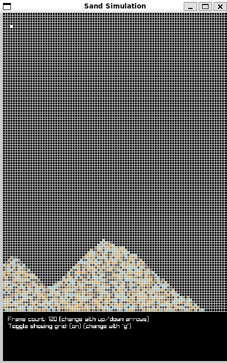
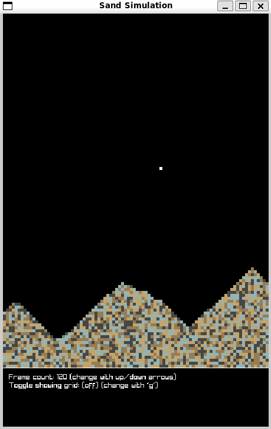

# Sand Simulation Program

This program is made to get to know C++ and the raylib library.

## Screenshots
Application display with active grid             |  Application display with disabled grid
:-------------------------:|:-------------------------:
  |  
